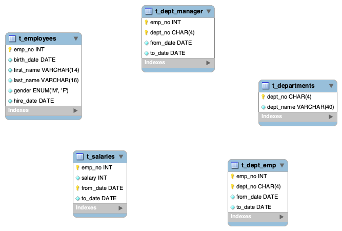

# SQL-Portfolio

This repository contains examples of SQL queries that I have written for data analytics projects I have worked on. 
The sql queries are an integration with data visualisation I created using Tableau. 

# Highlighted Projects

- Analyse Employees in a Company throughout the years of 1980s to 1990s at a fictional company - [SQL](Business_Tasks.sql): In this project, I used a big dataset found on [github](https://github.com/datacharmer/test_db/tree/master?tab=readme-ov-file) to Perform data analysis and answer 4 business questions combining SQL and Tableau [visualisations](https://public.tableau.com/app/profile/veronica.mucha/vizzes)
   - What is breakdown between the male and female employees working in the company each year, starting from 1990
   - Compare the number of male managers to the number of female managers from different departments for each year, starting from 1990
   - Compare the average salary of female versus male employees in the entire company until year 2002, per each department
   - The average male and female salary per department within a certain salary range

- Analyse the Absenteeism at a fictional company during work time. The data used is Secondary data provided as .csv files
  Problem:
    -  The business environment nowadays is competetive, which leads to increased pressure in the workplace
    -  Unachievable business goals lead to higher stress levels
    -  Risk of unemployment can also be detrimental to a person's health
The above can result in minor or even major illnesses which may or may not develop into a long term condition for instance depression or anxiety.
In this project, I look more into predicting absenteeism from work meaning clarifying whether or not an employee can be expected to miss work for a specific number of hours in any given workday resulting in temporary incapacity to do regular working activities.
How is this beneficial to know: Knowing this information in advance can help a company reorganise the work processes in a manner that allows the company to avoid a lack of productivity and increase the quality of work.

Overall: As a Data Analyst I would like to know for how many working hours can an employee be away from work based on information such as 

   - How many children does the employee have
   - How far does the employee live from the office
   - How many pets does the employee have
   - Does the employee have higher education or not
   - The age of the employee
